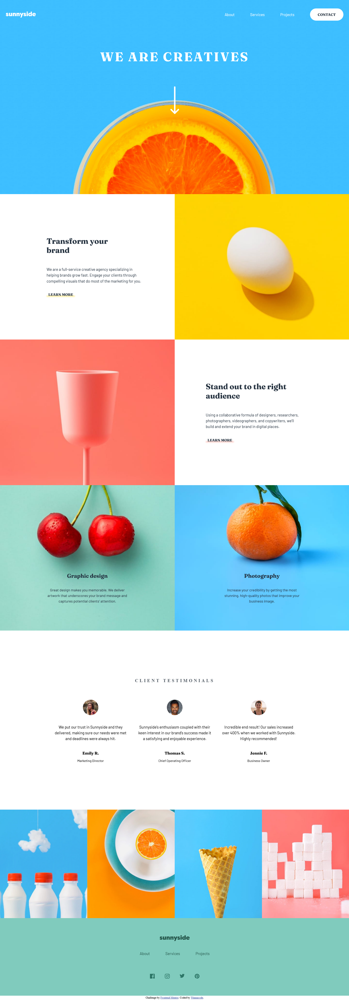
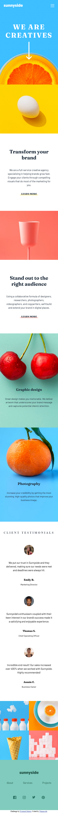
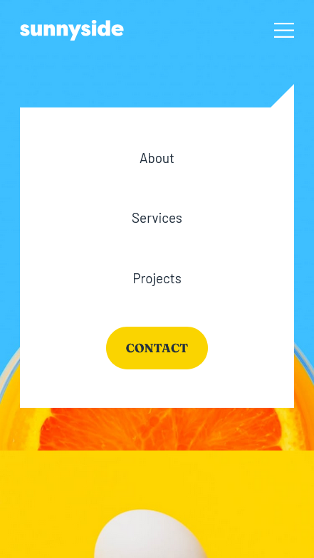
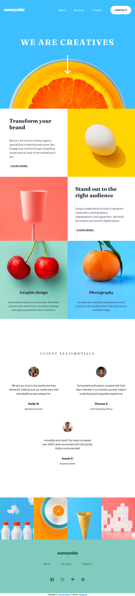

# Frontend Mentor - Sunnyside agency landing page solution

This is a solution to the [Sunnyside agency landing page challenge on Frontend Mentor](https://www.frontendmentor.io/challenges/sunnyside-agency-landing-page-7yVs3B6ef). Frontend Mentor challenges help you improve your coding skills by building realistic projects.

## Table of contents

- [Overview](#overview)
  - [The challenge](#the-challenge)
  - [Screenshot](#screenshot)
  - [Links](#links)
- [My process](#my-process)
  - [Built with](#built-with)
  - [What I learned](#what-i-learned)
  - [Continued development](#continued-development)
- [Author](#author)

## Overview

The challenge is to build out this landing page and get it looking as close to the design as possible.

### The challenge

Users should be able to:

- View the optimal layout for the site depending on their device's screen size
- See hover states for all interactive elements on the page

### Screenshot

### Links

- Solution URL: [Solution URL here](https://github.com/kwngptrl/FEM-sunnyside-agency-landing-page-main)
- Live Site URL: [Live site URL here](https://kwngptrl.github.io/FEM-sunnyside-agency-landing-page-main/)

## My process

Initially, the HTML and CSS were done barebones with an eye towards converting this by using the Astro framework. Then, I applied BEM methodology to the CSS. The JS was last.

### Built with

- Semantic HTML5 markup
- CSS custom properties with BEM methodology
- Flexbox & Grid
- Mobile-first workflow
- Vanilla JS

### What I learned

Some parts, like the navigation bar, I learned from YouTuber Coding2Go and customized it, some from DuckDuckGo's AI when I searched for something. Those parts can be seen along with the comments in the source code.

### Continued development

Might try translating this using a JS framework like Astro in the not too distant future.

## Author

- Frontend Mentor - tor - [@Wannacode](https://www.frontendmentor.io/profile/kwnngptrl)

